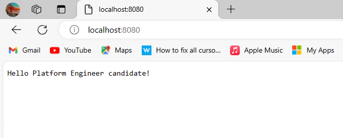

# Platform Engineer Technical Test

## Goal of Project:

*Build our container Image*

*Containerize our Go Application*

*Run our Go Application*

*Test Our Go App Locally*

*Push our Code to Github*

*Create a CI pipeline that builds the container image and pushes it to a registry*

---

1. First step is to build and run image locally with our default port defined in our Dockerfile 8080.

    `docker build -t go-app .`

    Alternatively we can build with custom ports.

    `docker build --build-arg PORT=<your-preferred-port> -t go-app .`

  2. Run our Go container with our default port specified 8080 and a name  for our container.

      `docker run -d --name my-app -p 8080:8080  -it go-app`

      This will start the container and map the host's port 8080 to the container's port 8080.
      
      You can also designate a custom port by utilizing the PORT environment variable.

      `docker run -d --name my-app -e PORT=8000 -p 8080:8080 go-app`
    

  3. It's a best practice to perform local testing on our Go application using the designated ports prior to committing it to our repository.

     

  4. We are in the process of pushing our Dockerfile along with any modifications to GitHub.

     `git add .`

     `git commit -m "added new files"`

     `git push -u origin main`

  5.  The configuration for the Continuous Integration (CI) pipeline is located in  the `.github/workflows/ci.yml` file, and it makes use of GitHub Actions. 

      The work of creating the container image for the Linux/amd64 and Linux/arm64 platforms is handled by this pipeline. Following the build, these images are pushed to the Docker Container Registry.

      We may either make changes to the `main` branch or build a new release to start the continuous integration workflow.
